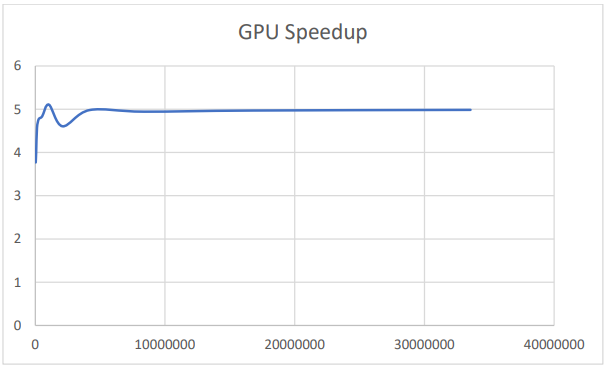

**K-Means Clustering** 

**Abstract:** 

The program aims to execute the k-means clustering algorithm on both the CPU and GPU. The datapoints are classified in a cluster based on the distance from the cluster. The means are updated for each iteration by adding all the points in the cluster and dividing by the total number of points I the cluster. The GPU implementation is implemented with constant memory as it is faster when many threads are accessing the same values. 

**Design Methodology:** 

The data is initialized by randomizing values using rand() function. Each data point is assigned random clusters by assigning a random value from 0-2 for each data point. The data is initialized once and copied to 2 data locations, one for the CPU and one for the GPU. This is done since the data points are overwritten in the implementations.  

The K-means clustering algorithm was implemented in two phases in the CPU. The first part was the assignment of clusters to the data points. Each data point was assigned the cluster based on the closest cluster centre by using the distSq() in the Vector2 Structure. The means of the coordinates were taken from the data point and the centres of the clusters were updated. The whole process was iterated until none of the datapoints are changing clusters. This was achieved by using the altered data member in the Datapoint structure. 

The GPU implementation was achieved by assigning the parallel part of the code in the GPU and updating was handled by the host itself. Constant memory is used in the GPU since there are many threads accessing the same values at the same time. Constant memory is cached and has very low latency. Since we are storing a few points, we use constant memory to store the centres of the clusters(means). The data is moved to constant memory using MemcpyToSymbol(). Constant memory is declared globally in the .cu file and is updated in each iteration. The while loop checks for alteration of data points and stops the iterations when none of the points are changing clusters. 

**Results:** 

*Figure 1: Clustering Input*** 

*Figure 2: Clustering Output CPU* 

*Figure 3: Clustering Output GPU* 

*Figure 4: Output for size of 2^16 Table 1: Speedup* 

|**Data Size** |**CPU Time(ms)** |**GPU Time(ms)** |**GPU Speedup** |**% Misclassified** |
| - | :- | :- | :- | :- |
|32768 |49 |13 |3.769231 |11.3617 |
|65536 |100 |25 |4 |11.5036 |
|131072 |183 |40 |4.575 |11.4357 |
|262144 |458 |96 |4.770833 |11.5185 |
|524288 |865 |179 |4.832402 |11.5547 |
|1048576 |919 |180 |5.105556 |11.5547 |
|2097152 |1985 |431 |4.605568 |11.5608 |
|4194304 |4812 |966 |4.981366 |11.5922 |
|8388608 |19803 |4006 |4.943335 |11.5779 |
|16777216 |47642 |9586 |4.969956 |11.5828 |
|33554432 |79626 |15973 |4.985037 |11.5679 |

*Figure 5 Speedup plot Size Vs Speedup:* 

**Result Analysis:**

The results shows that speedup is observed on the GPU due to uses of parallelism and usage of constant memory. The average speedup is about 4. We also notice a value in the speedup where the speedup is slightly lesser, but once there are a huge number of threads, the GPU performs consistently. 

**Questions:** 

1. You used constant memory as part of this implementation. Why does it make sense to use constant memory for the clusters? What is the maximum number of clusters that you could store in constant memory?   

Ans:

Constant memory was right for implementing as they have very low latency access and are useful when several threads are accessing the same locations repeatedly. Here, during assignment, all the threads are accessing the clusters’ means at the same time.   

Each cluster is of a datatype Vector2. Each vector2 occupies a space of 8 bytes ( 2\*sizeof(float)). 

Constant memory can store maximum 64KB of data, that is 64\*1024 = 65536. Therefore a maximum of 8192 clusters can be stored in constant memory. 

2. Could you have used constant memory for the data points as well? Make sure that your answers are very specific and include concrete numbers to back up your claim.** 

Ans: 

There are a huge number of data points and would overfill the constant memory and would not be suitable to use constant memory for the data points.  

Each datapoint is a datatype of Datapoint which occupies 16 bytes (returned by the compiler). Therefore 65536/16 = 4096. 4096 is a limited number of datapoints to store and would not be ideal. The example we have used cover about 65536 points and 4096 points is nowhere close. 

**Conclusion:** 

Implementations were done on both the CPU and GPU and checked for speedup. The GPU performed better due to the bottlenecking part of the code was parallelizable. The constraints on constant memory was also analysed due to the small size of the constant memory. Using these constraints, proper utilization of the constant memory could be done. There was also an understanding of the parts that GPUs are good at and CPU were good at. This understanding was used to only implement a part of the code on the GPU kernel and the rest was done on the host side code. 

